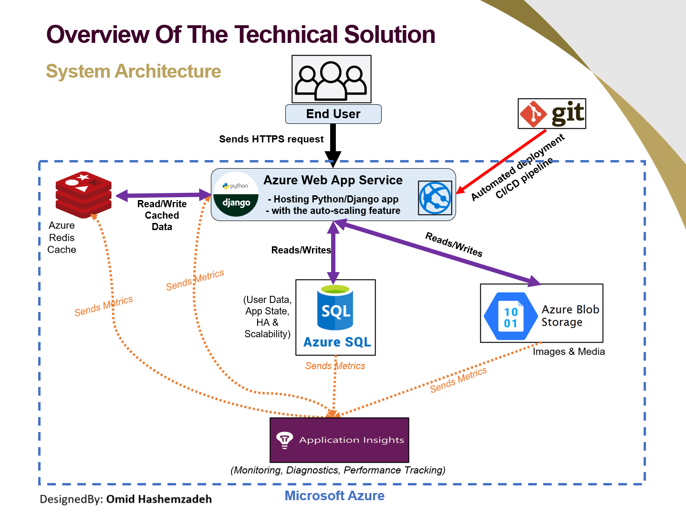

# 📸 Photo Sharing App (Django + Azure)

A full-stack Django web application that allows users to upload, view, rate, and comment on photos. Built for scalability, observability, and automation using Microsoft Azure services and GitHub Actions for seamless CI/CD deployment.

---

## 🚀 Features

* User registration, login, and logout
* Upload images with metadata: title, caption, location, and tagged users
* Paginated gallery to view photos
* Rate photos (0–5) and post comments
* Media stored in Azure Blob Storage
* Relational data stored in Azure SQL Database
* Caching with Azure Redis (optional)
* Secure authentication with CSRF protection
* GitHub Actions-based CI/CD deployment

---

## 📆 Requirements

* Python 3.12
* Django 5.x
* Azure SQL Database (server + database created)
* Azure Blob Storage (container for media)
* Azure Web App (Linux, Python 3.12)
* Azure Cache for Redis (optional)
* `pip`, `virtualenv`

---

## 🧰 Motivation and Scalability Challenge

Modern web apps face issues like traffic spikes, slow response times, and inefficient resource use. This project adopts a scalable architecture to:

* Handle fluctuating demand
* Prevent service interruptions
* Optimize performance and cost-efficiency

## 📊 Project Presentation

You can view the detailed project presentation slides here:

[📥 Download Presentation (PPTX)](assets/presentation.pptx)


---

## 🏐 System Architecture Overview

* **Backend**: Django (Python)
* **Database**: Azure SQL Database
* **Media Storage**: Azure Blob Storage
* **Hosting**: Azure Web App (Linux)
* **Caching**: Azure Redis Cache (optional)
* **Monitoring**: Azure Application Insights
* **CI/CD**: GitHub Actions


## 🏗️ System Architecture Diagram

<p align="center">
  
</p>

This diagram illustrates how the Django backend interacts with Azure services including SQL Database, Blob Storage, Redis Cache, and how GitHub Actions enables automated deployment to Azure Web App.


---

## ☁️ Azure Setup Guide

### 1. Azure SQL Database

* Create SQL Server and database via Azure Portal.
* Enable firewall rules for GitHub Actions and your IP.
* Save credentials for `.env`.

### 2. Azure Blob Storage

* Create a storage account and container (`media`).
* Configure access and obtain keys for `.env`.

### 3. Azure Redis Cache (Optional)

* Create Redis resource (e.g., Basic C0 tier).
* Add host, port, and password to `.env`.

### 4. Azure Web App

* Create Linux Web App (Python 3.12).
* Optional startup command: `gunicorn MyDjangoProject.wsgi`
* Link GitHub repo in Deployment Center.
* Add `.env` variables in **App Settings**.

---

## 🧰 Local Development Setup

### 1. Clone the Project

```bash
git clone https://github.com/ohashemzadeh/photo-sharing-app.git
cd photo-sharing-app
```

### 2. Create and Activate Virtual Environment

```bash
python -m venv venv
source venv/bin/activate  # On Windows: venv\Scripts\activate
```

### 3. Install Project Dependencies

```bash
pip install -r requirements.txt
```

### 4. Create a `.env` File

```ini
SECRET_KEY=your-secret-key
DEBUG=True

DB_NAME=your-db-name
DB_USER=your-db-user
DB_PASSWORD=your-db-password
DB_HOST=your-db-host.database.windows.net
DB_PORT=1433

AZURE_STORAGE_ACCOUNT_NAME=yourstorageaccount
AZURE_STORAGE_ACCOUNT_KEY=yourstoragekey
AZURE_STORAGE_CONTAINER_NAME=media

CSRF_TRUSTED_ORIGINS=https://your-web-app.azurewebsites.net

# Optional Caching with Azure Redis
ENABLE_REDIS_CACHE=True
REDIS_HOST=yourcache.redis.cache.windows.net
REDIS_PORT=6380
REDIS_PASSWORD=your-redis-access-key
CACHE_TIMEOUT=300
```

### 5. Apply Migrations

```bash
python manage.py migrate
```

### 6. Create Superuser (optional)

```bash
python manage.py createsuperuser
```

### 7. Run the Development Server

```bash
python manage.py runserver
```

Visit [http://127.0.0.1:8000](http://127.0.0.1:8000) and login or register.

---

## 🔄 GitHub Actions Deployment

A complete workflow is included to:

* Build your Python environment
* Install ODBC Driver and Redis support
* Run Django migrations and collect static files
* Deploy to Azure Web App

### Required GitHub Secrets

Add these under `Settings > Secrets > Actions`:

* `SECRET_KEY`
* `DB_NAME`, `DB_USER`, `DB_PASSWORD`, `DB_HOST`, `DB_PORT`
* `AZURE_STORAGE_ACCOUNT_NAME`, `AZURE_STORAGE_ACCOUNT_KEY`, `AZURE_STORAGE_CONTAINER_NAME`
* `AZUREAPPSERVICE_PUBLISHPROFILE_...`
* `CSRF_TRUSTED_ORIGINS`
* `ENABLE_REDIS_CACHE`, `REDIS_HOST`, `REDIS_PORT`, `REDIS_PASSWORD`, `CACHE_TIMEOUT`

---

## 🔢 Monitoring & Observability

Using **Azure Application Insights** to monitor:

* Live performance (CPU, memory, latency)
* Request traces and error logs
* Alerts for downtime or slow response

---

## 📊 Scalability Evaluation

| Component          | Strategy                                |
| ------------------ | --------------------------------------- |
| Azure Web App      | Horizontal auto-scaling                 |
| Azure SQL Database | Hyperscale, elastic pools               |
| Azure Blob Storage | Tiered storage + CDN support            |
| Azure Redis Cache  | Caches frequent queries, lowers DB load |
| GitHub Actions     | Ensures fast, repeatable deployments    |

---

## 🛡️ Caching & Scalability

* Redis cache is toggleable via `.env`
* Shared gallery cache key for faster access
* Auto-invalidates on new uploads/comments/ratings
* Configurable expiry with `CACHE_TIMEOUT`

---

## 📂 Project Structure Highlights

* `users_app`: User auth (signup, login, logout)
* `pictures_app`: Photo handling, rating, comments
* `templates/`: HTML templates
* `.github/workflows/`: CI/CD configuration

---

## 👤 Author

Designed & Developed by **Omid Hashemzadeh**
[LinkedIn](https://www.linkedin.com/in/omid-hashemzadeh-2b3048113/)
\ua9 2025

---

## 📍 License

Licensed under the [MIT License](LICENSE)
